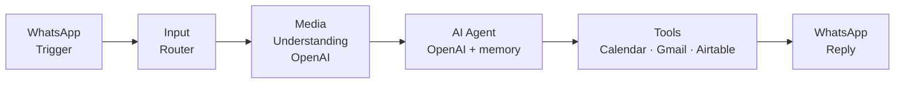
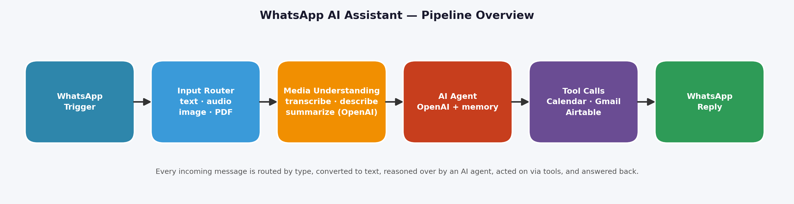

# WhatsApp AI Assistant (n8n)

An always-on WhatsApp assistant built on n8n + OpenAI. It doesn't just reply — it reads text, transcribes voice notes, describes images, and summarizes PDFs, then takes action: creating Google Calendar events, sending emails via Gmail, and updating Airtable contacts based on what's in the message.

## Problem

WhatsApp messages pile up across text, voice notes, photos, and documents. Answering each one by hand — and then doing the follow-up work (booking the meeting, sending the email, updating the contact record) — means messages sit unread overnight and things slip.

## How It Works

Every incoming message flows through one pipeline:

| # | Stage | What happens |
|---|-------|--------------|
| 1 | WhatsApp Trigger | Incoming message arrives via the WhatsApp webhook |
| 2 | Input Router | Detects the message type: text, voice note, image, or PDF |
| 3 | Media Understanding | Voice notes transcribed, images described, PDFs summarized (OpenAI) |
| 4 | AI Agent | Reads the converted text + conversation history and decides: reply or act (OpenAI + memory) |
| 5 | Tool Calls | Google Calendar (create events), Gmail (send emails), Airtable (update contacts) |
| 6 | WhatsApp Reply | Sends the response back to the chat |

## Tech Stack

| Component | Purpose |
|---|---|
| n8n | Orchestration, webhook handling |
| WhatsApp Business API (webhook) | Message transport |
| OpenAI | Transcription, image understanding, PDF summarization, agent reasoning |
| Google Calendar | Event creation from messages |
| Gmail | Outbound email triggered by messages |
| Airtable | Contact record updates |

## Build It Yourself

The import-ready workflow file is private, but the architecture above is complete enough to rebuild:

1. **Trigger**: a WhatsApp webhook node catching incoming messages.
2. **Router**: IF / Switch nodes splitting on message type (text / audio / image / document).
3. **Media understanding**: send audio to OpenAI transcription, images to OpenAI vision, PDFs through summarization — every branch outputs plain text.
4. **Agent**: an AI Agent node (OpenAI chat model + window memory) receiving the converted message plus chat history. Give it three tools: Google Calendar (create event), Gmail (send email), Airtable (update record).
5. **Reply**: send the agent's text response back through the WhatsApp send node.

## Capabilities

- Four input types handled automatically: text, voice notes, images, PDFs
- Takes action, not just replies: calendar events, emails, contact updates
- Always on — nothing sits unanswered overnight or over a weekend

## Notes

- Requires a WhatsApp Business API number (e.g. Meta Cloud API) to receive and send messages; webhook verification is part of setup.
- The import-ready `workflow.json` is not published (private build); this repo documents the architecture.

## License

MIT — architecture and docs are free to learn from and rebuild.
